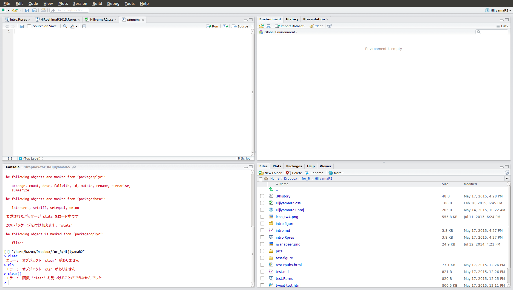
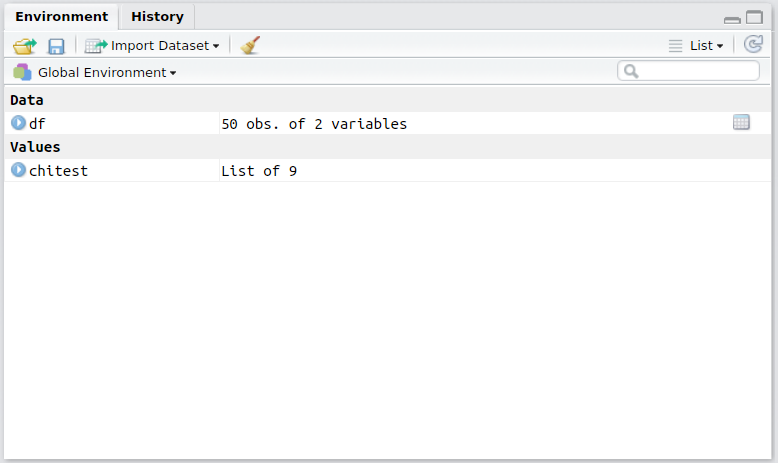

## R(RStudio)の起動

基本、RStudioを起動すればOKです。早速起動させましょう。

## RStudioの画面

RStudioは主に4つの部分(pane)に分かれています:



### 左下: Console


Rを対話的に操作するところです。コマンドを記述して実行します。Rに対して「これをやれ」と指示を出し、その結果もまたここに出てきます。

### 左上: Source Editor


Rのスクリプトやファイルなどを編集する場所です。ここで各種ファイルを開き、コードを編集して保存したり、そのコードを実行します。ここでコードを実行すると、その内容がConsoleへ順次送られて実行されます。

通常、ここでRスクリプトファイル(*.R)を作成して、それを実行して作業をしていきます。よって、おそらくは多くの場合ここが一番利用するところとなるでしょう。

### 右下: File, Plots, Packages, Helpなど


#### File

ディレクトリ(フォルダ)にアクセスします。各ファイルをクリックするとその場で開くことができます。また名前の変更やディレクトリ作成などもできます。

#### Plots

グラフなどを出力すると、ここに表示されます。ある程度遡れますし、ここから画像などにエクスポートすることもできます。

#### Packages

Rの拡張パッケージを管理できます。**Rはパッケージがポイント**になるので、頻繁に利用します。「パッケージとは何か」については後述します。

#### Help

ヘルプウィンドウで、Rの関数などを検索したり、その組み込みのヘルプを閲覧することができます。ただあまりここから検索することは少なく、Consoleで `?help` というようにしてヘルプを表示させるのがメインです

### 右上: Environment, Historyなど



#### Environment

Rの**環境**を表示します。とりあえずは「今Rで読み込んだり作ったりしてるデータや変数といったものが見れる」と考えておいてください。

#### History

Consoleで実行した内容の履歴です。ここから再度Consoleに送ったり、Scriptに送ったりすることもできます。

## まずはとにかく触ってみよう

まず、Rを使うとどんな感じになるのか、試しに触ってみましょう。それぞれの解説については後述します。

### データの読み込み

Rでデータを読みこませる場合、csvファイルからが一般的です。ここでは、"iris-data.csv"というファイルを読み込みます。

Consoleで以下を入力してEnterで実行しましょう:

```{r}
iris.data <- read.csv("iris-data.csv")
```

これでデータが読み込まれます。RStudio右上のEnvironmentのところに、`iris.data`というのが出てきているはずです。

### データ構造を確認

Environmentのところにある`iris.data`をクリックすると、そのデータセットを見ることができます。


また、Consoleで以下のコードを入力してEnterで実行しましょう:

```{r}
str(iris.data)
```

`iris.data`として読み込んだデータの内容が表示されます。細かいところは省略しますが、大体はつかめるかと思います。

### 集計

それでは、現在Rにある`iris.data`というデータセットについて、平均や中央値、最大最小など集計してみましょう。Consoleで以下のコードを入力して実行してください:

```{r}
summary(iris.data)
```

各変数の基礎統計が算出され、表示されたかと思います。

### 分析

それでは、Speciesを独立変数、Sepal.Lengthを従属変数とする1要因3水準の分散分析を実施してみます:

```{r}
result <- aov(Sepal.Length ~ Species, data = iris.data)
```

これで分散分析の結果がresultに入ってます。ではこの結果の分散分析表を確認します:

```{r}
summary(result)
```

それではこれを多重比較してみます。まずはholmで:

```{r}
pairwise.t.test(iris.data$Sepal.Length, iris.data$Species)
```

次にTukeyのHSDで:

```{r}
TukeyHSD(result)
```

### 図示

これらの結果を図示します。まずは各水準ごとで要約統計量算出:

```{r}
by(iris.data$Sepal.Length, iris.data$Species, summary)
```

これを箱ひげ図でプロット:

```{r}
plot(iris.data$Species, iris.data$Sepal.Length)
```

## 分析の流れ

結局のところ、分析の流れは以下のようになるかと思います。

1. データの作成
    - 入力など
2. データの読み込み
    - 何らかのファイルなどからRに読み込む
3. データの整形
    - 不適切なデータの除去、計算項目など
4. データの集計
    - データの要約、可視化など
5. データの分析
    - それぞれの分析の実行
6. 結果の可視化
    - Plotする

この資料も、この流れを意識して作成しています。


[ページのトップへ](#)